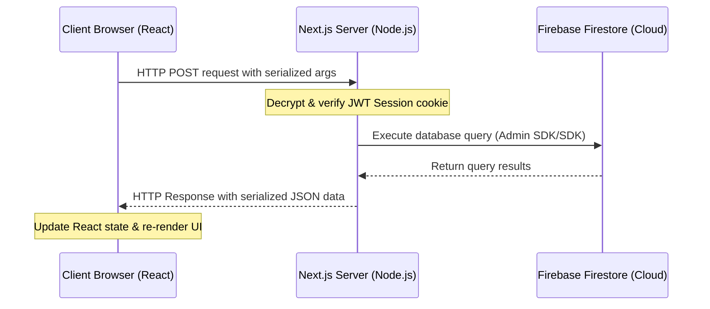

# ⚙️ Backend Actions

The backend runs on the server side using Next.js **Server Actions**. This file details how actions work, how user sessions are verified, and lists the critical action methods.

---

## 🔀 Server Action Execution Flow
When a React component calls a server action, Next.js automatically executes the following steps behind the scenes:

---

## 🔒 Session Verification (`src/lib/auth.ts`)
Before running any sensitive database query (like adding a marketplace item or deleting a post), the server verifies the user's identity:
1. **Cookie Parsing**: Reads the HTTP-only, secure cookie containing the session JWT token.
2. **JWT Decoding**: Decodes the token to read:
   - `user.id`: Firestore user document ID.
   - `user.email`: Student institutional email.
   - `user.role`: Access levels (`student`, `cr`, `developer`).
3. **Guard Clauses**: Returns `null` or throws an `Unauthorized` error if session validation fails, preventing malicious requests.

---

## 📂 Deep Dive: Action Modules

### 1. Lost & Found Actions ([`lostfound.ts`](file:///c:/Users/harsh/Desktop/NIT%20HAMIRPUR%20APP/src/app/actions/lostfound.ts))
* `fetchLostFoundItems()`: Fetches the newest reports ordered by date.
* `createLostFoundItemAction(title, description, type, location, date, contact, image, images, userId, userName)`: Validates the phone format, checks if images are attached, and adds a record in the `lost_found` collection.
* `runSeedingAction()`: Triggers the mock database cleanup and populates fresh sample data.

### 2. Marketplace Actions ([`marketplace.ts`](file:///c:/Users/harsh/Desktop/NIT%20HAMIRPUR%20APP/src/app/actions/marketplace.ts))
* `getMarketplaceItemsAction()`: Queries listings in the `marketplace` collection.
* `createMarketplaceItemAction(title, description, originalPrice, sellingPrice, contactNumber, image, userId, userName, category)`: Adds a new item. Automatically computes the discount percentage shown in the UI.
* `updateMarketplaceItemStatusAction(id, status)`: Updates listing status from `'active'` to `'sold'`, which fades out the item in the UI.

### 3. Breadit Actions ([`breadit.ts`](file:///c:/Users/harsh/Desktop/NIT%20HAMIRPUR%20APP/src/app/actions/breadit.ts))
* `fetchBreaditPostsAction()`: Fetches forum posts.
* `createBreaditPostAction(title, content, userId, userName)`: Publishes a post.
* `createBreaditCommentAction(postId, content, userId, userName)`: Inserts a comment under a specific post ID and increments the post's `comments_count`.
* `deleteBreaditPostAction(postId)`: Requires `cr` or `developer` role. Deletes the post document and all comments associated with it.

### 4. Chat & Message Actions ([`chat.ts`](file:///c:/Users/harsh/Desktop/NIT%20HAMIRPUR%20APP/src/app/actions/chat.ts))
* `fetchChatrooms()`: Fetches list of categories.
* `sendChatMessage(chatroomId, text, userId, userName)`: Checks if `text` contains blocked words from the blocklist. If clean, saves to `messages`.
* `reportMessageAction(messageId, userId)`: Increments a report counter on the message.
* `dismissReportsAction(messageId)`: Clears report counters (requires Developer role).

---

## 🔗 Connections
* Back to: **[[App Architecture Index]]**
* Next: Explore the Firestore schemas in **[[Database and Seeding]]**
