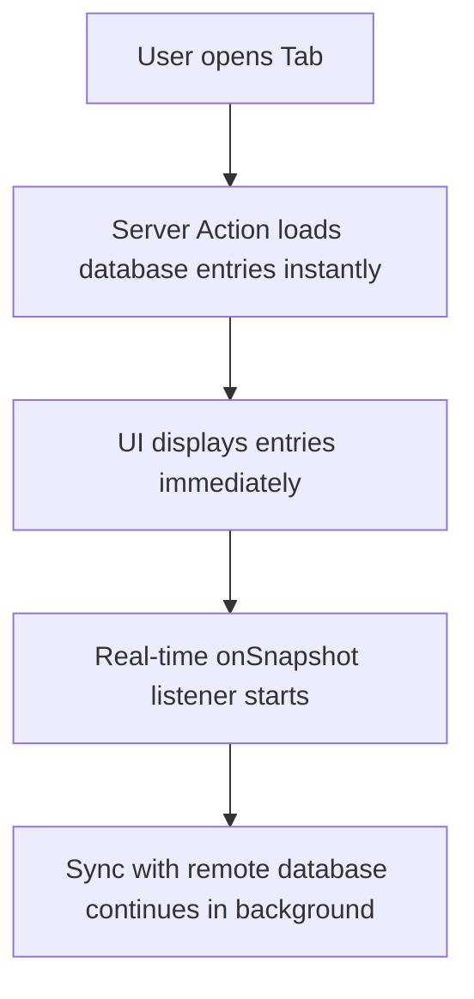

# ⚡ Real-Time Data Sync

To make the app feel alive, NITH Connect updates lists (like chat messages or forum posts) instantly when other users make changes, without requiring a page refresh.

---

## 🛜 How it Works: Firestore `onSnapshot`
The app uses a Firebase function called `onSnapshot`. 

This sets up a live connection between the client (your mobile phone/browser) and the Firestore database. Whenever a document inside a collection is added, modified, or deleted:
1. Firestore sends the change to the client.
2. The client updates its local React state.
3. React automatically re-renders the UI to show the new data.

---

## 🔄 Hybrid Loading Pattern
To prevent loading screens and provide a fast experience, NITH Connect uses a **hybrid loading pattern** for **Chat**, **Lost & Found**, and **Breadit**:



1. **Instant Fetch**: The app runs a Server Action (which executes fast on the server) to load the initial list.
2. **Live Listeners**: The app registers the client-side `onSnapshot` listener to handle incoming updates.
3. **The Cache Sync Guard**: To prevent the empty local offline browser cache from wiping out the server-loaded items, we use the following guard:
   ```typescript
   if (snapshot.empty && snapshot.metadata.fromCache) return;
   ```
   This guarantees that if the cache is empty on load, it won't clear the screen while it connects to the server.

---

## 🔗 Connections
* Back to: **[[App Architecture Index]]**
* Go back to start: **[[App Architecture Index|Full Map]]**
