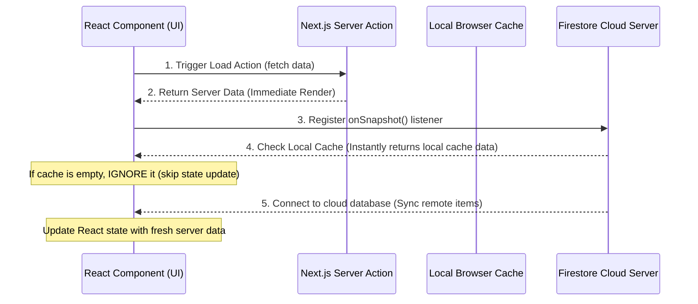

# ⚡ Real-Time Data Sync

NITH Connect uses Firebase Firestore's real-time listeners to sync messages, forum posts, and reports instantly across all active users.

---

## 🛜 Real-Time Communication Mechanics
Firestore implements real-time updates by maintaining a persistent connection (via WebSockets or HTTP long-polling) between the client application and the cloud server. 

When you register a listener using `onSnapshot`:
1. **Delta Updates**: The client receives only the changes (adds, modifications, or deletes) rather than downloading the entire collection again.
2. **State Propagation**: The component maps the documents to a list, sorts them client-side, and calls the state setter (e.g., `setChatMessages`), triggering a React re-render.

---

## 🏎️ Hybrid Loading Architecture & Cache Sync Guard
To ensure instant loading times while maintaining live updates, NITH Connect uses a hybrid design.

### 1. The Sequence Flow


### 2. The Cache Synchronization Bug
Firestore's client SDK caches data locally to support offline mode. When `onSnapshot` is called, it immediately returns the local cache snapshot:
* If a collection is opened for the first time, the local cache has **no documents** (`snapshot.empty === true`).
* The local cache flags itself as not synced yet (`snapshot.metadata.fromCache === true`).
* If the success callback is executed, it overrides the items already loaded from the Server Action, clearing the screen.

### 3. The Code Guard Solution
To fix this, we added the following check at the top of the `onSnapshot` callbacks in [`dashboard-client.tsx`](file:///c:/Users/harsh/Desktop/NIT%20HAMIRPUR%20APP/src/app/dashboard-client.tsx):
```typescript
const unsubscribe = onSnapshot(q, (snapshot) => {
  // Ignore local empty cache updates while waiting for server sync
  if (snapshot.empty && snapshot.metadata.fromCache) return;
  
  const items = snapshot.docs.map(doc => { ... });
  setLostFoundItems(items);
}, (err) => {
  console.error('Listener failed:', err);
});
```

---

## 🔗 Connections
* Back to: **[[App Architecture Index]]**
* Go back to start: **[[App Architecture Index|Full Map]]**
